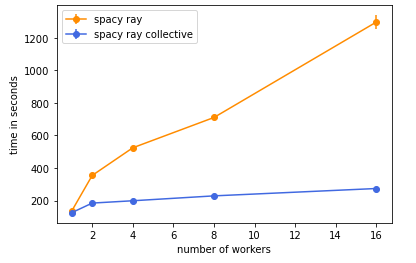
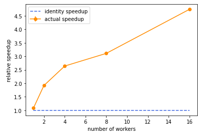

# spacy_ray_collective
This github is inherited from spacy-ray (dev branch). It trains model using the new collective calls available in current ray-1.2-dev, replacing the original get(), set() usage in spacy-ray. <br />
The runtime comparison for 1000 update using spacy pipeline = ["tok2vec", "ner"]: <br />

    | Comparison    | spacy-ray     | spacy-ray-nccl |  ratio  |  
    | ------------- | ------------- | -------------- | ------- | 
    | 1 worker      | 137.5 ± 2.1   | 125.8 ± 2.0    |  1.09x  |
    | 2 workers     | 354.1 ± 16.8  | 184.2 ± 1.28   |  1.92x  |  
    | 4 workers     | 523.9 ± 10.4  | 198.5 ± 0.85   |  2.64x  |  
    | 8 workers     | 710.1 ± 3.0   | 228.5 ± 1.60   |  3.11x  | 
    | 16 workers    | 1296.1 ± 42.1 | 273.7 ± 6.93   |  4.74x  | 

Mean and standard deviation obtained by three trials (in seconds).  <br />
<br />
Runtime comparison: The ideal plot should be a horizontal line. <br />
 <br />
<br />

Speedup comparison: The trivial speedup is a horizontal line y = 1. <br />
 <br />
    
 <br />
 
 ### To install the necessary module: <br />
 
   &nbsp; &nbsp; &nbsp; &nbsp;   1. ```conda create -n spacy-ray python=3.7.3``` <br />
   &nbsp; &nbsp; &nbsp; &nbsp;   2. ```conda activate spacy-ray``` <br />
   &nbsp; &nbsp; &nbsp; &nbsp;   3. ```pip install spacy-nightly[cuda]``` <br />
   &nbsp; &nbsp; &nbsp; &nbsp;&nbsp; &nbsp; &nbsp; &nbsp;    - This will take some time, if observe a build error in cupy, try: ```pip install cupy-cuda[version]``` 
   &nbsp; &nbsp; &nbsp; &nbsp;&nbsp; &nbsp; &nbsp; &nbsp;      e.g. for cudatoolkit 11.0: pip install cupy-cuda110 <br />
   &nbsp; &nbsp; &nbsp; &nbsp; 4. ```pip install spacy-ray``` <br />
   &nbsp; &nbsp; &nbsp; &nbsp;&nbsp; &nbsp; &nbsp; &nbsp;    - Run     ```python -m spacy ray --help```     to check this module is installed correctly <br />
   &nbsp; &nbsp; &nbsp; &nbsp; 5. The collective calls are only available in current ray github. Instead we use the latest ray-1.1 in pip to test runtime. <br />
   &nbsp; &nbsp; &nbsp; &nbsp;&nbsp; &nbsp; &nbsp; &nbsp;    - Get collective code:     ```git clone https://github.com/ray-project/ray``` <br />
   &nbsp; &nbsp; &nbsp; &nbsp;&nbsp; &nbsp; &nbsp; &nbsp;    - access the installed code of ray 1.1:    ```cd [path-to-packages]/ray``` <br />
   &nbsp; &nbsp; &nbsp; &nbsp;&nbsp; &nbsp; &nbsp; &nbsp;     If using conda, typically the path would be ```[path-to-conda]/anaconda3/envs/spacy-ray/lib/python3.7/site-packages/``` <br />
   &nbsp; &nbsp; &nbsp; &nbsp;&nbsp; &nbsp; &nbsp; &nbsp;    - copy the code over: ```cp -r [path-to-github-ray]/python/ray/util/collective [path-to-ray]/ray/util``` <br />
   &nbsp; &nbsp; &nbsp; &nbsp;&nbsp; &nbsp; &nbsp; &nbsp;    - add to "init" file: ```vim [path-to-ray]/ray/util/__init__.py``` -> from ray.util import ray, append "collective" to the "all" dict. <br />
    &nbsp; &nbsp; &nbsp; &nbsp; 6. The last step is to replace the installed spacy-ray using this github. <br />
    &nbsp; &nbsp; &nbsp; &nbsp;&nbsp; &nbsp; &nbsp; &nbsp;   - ```git clone https://github.com/YLJALDC/spacy_ray_nccl``` <br />
    &nbsp; &nbsp; &nbsp; &nbsp;&nbsp; &nbsp; &nbsp; &nbsp;   - ```mv [path-to-github-spacy-ray-nccl] [path-to-packages]``` <br />
    &nbsp; &nbsp; &nbsp; &nbsp;&nbsp; &nbsp; &nbsp; &nbsp;   - make a copy of the original spacy_ray in case you would like to recover the comparison:  ```mv [path-to-packages]/spacy_ray [path-to-packages]/spacy_ray_original``` <br />
    &nbsp; &nbsp; &nbsp; &nbsp;&nbsp; &nbsp; &nbsp; &nbsp;   - ```mv [path-to-packages]/spacy_ray_nccl [path-to-packages]/spacy_ray``` <br />

### To run examples: <br />

   &nbsp; &nbsp; &nbsp; &nbsp; 1. ```git clone https://github.com/YLJALDC/spacy_ray_example``` <br />
    &nbsp; &nbsp; &nbsp; &nbsp; 2. ```cd spacy_ray_example/tmp/experiments/en-ent-wiki``` <br />
    &nbsp; &nbsp; &nbsp; &nbsp; 3. Setup the ray cluster in different machine. The code will detect the available ray cluster and attach. <br />
    &nbsp; &nbsp; &nbsp; &nbsp; 4. Modify the config (for training hyperparameter) and project.yml (for number of workers) <br />
    &nbsp; &nbsp; &nbsp; &nbsp; 5. Download and process necessary files: (reference: https://github.com/explosion/spacy-ray/tree/develop/tmp/experiments/en-ent-wiki) <br />
    &nbsp; &nbsp; &nbsp; &nbsp;&nbsp; &nbsp; &nbsp; &nbsp;    - ```spacy project assets``` <br />
    &nbsp; &nbsp; &nbsp; &nbsp;&nbsp; &nbsp; &nbsp; &nbsp;    - ```spacy project run corpus``` <br />
    &nbsp; &nbsp; &nbsp; &nbsp; 6. spacy project run ray-train <br />

### Evaluation note: <br />

   &nbsp; &nbsp; &nbsp; &nbsp; The github turns off the score evaluation for comparison (because evaluation takes a long time, we only want to measure the speedup during training). <br />
    &nbsp; &nbsp; &nbsp; &nbsp; To turn on: comment the hard-coded socres in train() function at worker.py, change the if condition from if self.rank ==0 to if True, and uncomment socres = self.evaluate() <br />

### Implementation note: <br />

   &nbsp; &nbsp; &nbsp; &nbsp; The original spacy-ray uses sharded parameter server and update the model parameter in each worker asynchronizely. The current implementation uses all_reduce strategy, which <br />
performs similarly to a sharded parameter server. It has a whole copy of the model parameter in each worker. For update, it uses collective.allreduce() to synchronize gradients. <br />

### Ray cluster setup node:  <br />

   &nbsp; &nbsp; &nbsp; &nbsp; A template for setting up a 16 machine ray cluster: <br />
```
  1 #!/bin/bash 
  2 
  3 MY_IPADDR=$(hostname -i) 
  4 echo $MY_IPADDR 
  5 
  6 ray stop --force 
  7 sleep 3 
  8 ray start --head --port=6380 --object-manager-port=8076  --object-store-memory=32359738368 
  9 sleep 2 
 10 
 11 for i in {1..15} 
 12 do 
 13   echo "=> node $i" 
 14   ssh -o StrictHostKeyChecking=no h$i.ray-dev-16.BigLearning "cd spacy_ray_example/tmp/experiments/en-ent-wiki;  source ~/anaconda3/bin/activate; conda activate spacy-ray; ray stop --force; ray start --address='$MY_IPADDR:6380' --object-manager-port=8076 --object-store-memory=32359738368"; 
 15 done 
 16 wait 
```
    
